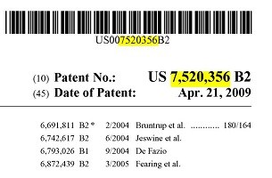

# Short guide to using the "design_kgex" package that is published in PyPI.

### Installation: Please run the following command in terminal.
```
pip install design_kgex
```

The above command will take into account all the necessary dependencies. Please make sure the environment is running Python > 3.8.

### Usage: Please run the following code to get raw patent text as a list of formatted and cleaned sentences.
```
from design_kgex import patent_text

sentences = patent_text.getPatentText(<Patent Number in String Format>)
```
*The patent number can be identified as follows.*



*Image Source*----[Modular wall climbing robot with transition capability, Google Patents](https://patents.google.com/patent/US7520356 "Google Patents") 

In the above image, the number "7520356" is a unique patent identifier that is also referenced as "patent_id" in various sources. Upon providing the input as a string, the following code will scrape sentences from the patent document, format these, and return a list of cleaned sentences.
```
from design_kgex import patent_text
sentences = patent_text.getPatentText("7520356")

#displaying the first 5 sentences
print(sentences[:5])
```
### Output:
*['The present invention is a mobile robot generally including a first suction module, a second suction module and a hinge assembly pivotably connecting the suction modules together.', 'Each of the suction modules includes a support frame defining a vacuum chamber and a vacuum unit supported on the support frame and communicating with the vacuum chamber.', 'The vacuum unit includes a rotating impeller and an exhaust cowling surrounding the impeller.', 'The impeller has an axis of rotation and is adapted 
to draw air from the vacuum chamber into the impeller in a direction generally parallel to the impeller axis of rotation.', 'The impeller is further adapted to discharge the drawn air from the impeller in a direction substantially perpendicular to the impeller axis of rotation.']*

### Usage: Please run the following code to extract design knowledge from a list of sentences.
```
from design_kgex import design_knowledge
knowledge = design_knowledge.extractDesignKnowledge(<Sentences in list format>)
```
The above code will return knowledge as a list, wherein, each item is a dictionary pertaining to the following format.
`
{
  "sentence": "...",
  "entities": ["entity #1", "entity #1"...],
  "facts": [["head entity", "relationship", "tail entity"], ["head entity", "relationship", "tail entity"]...]
}
`
Let us utilise the list of sentences obtained from the patent to extract design knowledge.
```
from design_kgex import patent_text, design_knowledge

sentences = patent_text.getPatentText("7520356")[:5]
knowledge = design_knowledge.extractDesignKnowledge(sentences)

#printing the first item in the list
print(knowledge[0])
```

### Output: 
*Sorry, no GPU is available! Processing will be performed in normal time.*

*100%|████████████████████████████████████████████████████████████| 5/5 [00:11<00:00,  2.38s/it]* 

*{'sentence': 'The present invention is a mobile robot generally including a first suction module, a second suction module and a hinge assembly pivotably connecting the suction modules together.', 'entities': ['the suction modules', 'a hinge assembly', 'a first suction module', 'the present invention', 'a second suction module', 'a mobile robot'], 'facts': [['the present invention', 'is', 'a mobile robot'], ['a mobile robot', 'generally including', 'a first suction module'], ['a mobile robot', 'generally including', 'a second suction module'], ['a mobile robot', 'generally including', 'a hinge assembly'], ['a hinge assembly', 'pivotably connecting', 'the suction modules']]}*

A note is given in the above output that GPU is not available. As the models used to extract design knowledge demand hardware support, it is recommended to use these in a GPU environment. If GPU is available, the package will automatically utilise the hardware support.

Besides, the output includes the sentence in a cleaned format, the entities and facts. 
 - Entities are subsets of noun-phrases in the sentence. The appropriate ones that communicate design knowledge are identified by the models that we have trained included in the package.
 - Facts associate a pair of the above list entities using a relationship that is communicated in the sentence. The fact is given in the form of a triple "head entity, relationship, tail entity".

The above exracted facts constitute a graph that represents design knowledge extracted from a list of sentences. To visualise the graph, various libraries like [networkx](https://networkx.org/documentation/stable/reference/generated/networkx.drawing.nx_pylab.draw_networkx.html "networkx") or [vis.js](https://visjs.github.io/vis-network/examples/network/labels/labelAlignment.html "vis.js").

For any queries, please write to siddharthl.iitrpr.sutd@gmail.com.
